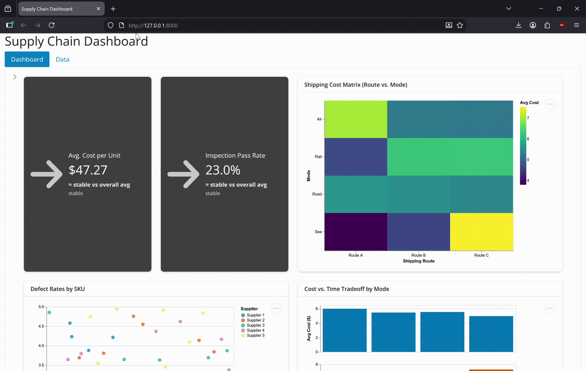

# Supply Chain Analytics Dashboard

## About

This interactive dashboard empowers supply chain managers in the fashion and beauty industry to make data-driven decisions through comprehensive visualization and analysis tools. Users can explore shipping costs across transportation modes and routes, compare supplier quality metrics, and optimize inventory management. The platform enables dynamic filtering, comparative analysis, and actionable insights for operational efficiency and cost optimization.

## Demo



## Getting Started

### Installation

1. Clone this repository:
```bash
git clone git@github.com:UBC-MDS/DSCI-532_2026_27_Supply_Chain_Dashboard.git
cd DSCI-532_2026_27_Supply_Chain_Dashboard
```

2. Create and activate the conda environment:
```bash
conda env create -f environment.yml
conda activate supply-app
```

3. Install required packages from requirements.txt:
```bash
pip install -r requirements.txt
```

### Running the Dashboard Locally

```bash
shiny src/run app.py
```

The dashboard will be available at `http://localhost:8000`

### View the Dashboard live
If you've made changes to the dev branch and have the pull request approved by one of our developers, you can view the changes to the dashboard [here](https://019c9b43-261d-12b0-0e9d-de4aab567c9e.share.connect.posit.cloud)

Once a new release is published, the most recent dev commits will be visible in the stable version of our dashboard, accessible [here](https://019c9b42-3095-b6d6-0bde-f47f0f78a6be.share.connect.posit.cloud)

## Contributing

Interested in contributing? Check out the [CONTRIBUTING.md](CONTRIBUTING.md) file for guidelines on how to contribute to this project.

## License

This project is dual-licensed:
- Software components are licensed under the MIT License - see [LICENSE](LICENSE) file for details
- Documentation and content are licensed under Creative Commons - see [LICENSE.md](LICENSE.md) file for details

## Code of Conduct

Please note that this project is released with a [Code of Conduct](CODE_OF_CONDUCT.md). By participating in this project you agree to abide by its terms.

## Team

- Rocco Lee (roccolee18)
- Amanpreet Binepal (amanbinepal)
- Junli Liu (junliliu1)
- Gaurang Ahuja (gaurang23)
