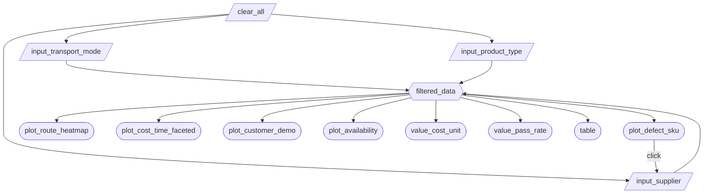
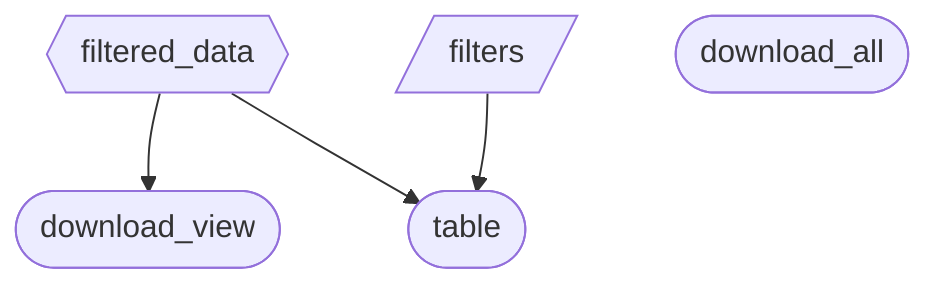

# Milestone 2 - App Specification

This document outlines the implementation plan for the Supply Chain Dashboard prototype. It serves as a living specification that will be updated throughout Milestones 3 and 4 as the application evolves.

---

## 2.1 Updated Job Stories

The following job stories guide our dashboard design and implementation:

| #   | Job Story                                                                                                                                  | Status         | Notes                                                                                    |
| --- | ------------------------------------------------------------------------------------------------------------------------------------------ | -------------- | ---------------------------------------------------------------------------------------- |
| 1   | When reviewing quarterly cost reports, I want to filter shipments by transportation mode and route so I can identify cost-effective methods | ✅ Implemented | Core filtering functionality implemented with checkbox group and visualization           |
| 2   | When evaluating supplier performance, I want to compare defect rates across suppliers and locations so I can make sourcing decisions      | ✅ Implemented | Supplier dropdown and defect rate scatter plot implemented with filtering when clicking on a point on the plot                              |
| 3   | When planning inventory levels, I want to visualize the relationship between lead times and stock levels so I can optimize buffer stock   | 🔄 Revised     | Refocused on stock availability visualization instead of lead time relationships         |
| 4   | When monitoring overall business performance, I want to see high-level KPI metrics so I can track operational health                      | 🔄 Revised     | Changed from revenue/sales KPIs to inspection pass rate and manufacturing cost per unit  |

---

## 2.2 Component Inventory

The dashboard contains **16 components** organized into two tabs (Dashboard and Data), exceeding the minimum requirement of 8 components for a 4-person team:

### Dashboard Tab - Core Components (13 components)

| ID                      | Type          | Shiny widget / renderer          | Depends on                                                   | Job story  |
| ----------------------- | ------------- | -------------------------------- | ------------------------------------------------------------ | ---------- |
| `input_transport_mode`  | Input         | `ui.input_checkbox_group()`      | —                                                            | #1         |
| `input_product_type`    | Input         | `ui.input_select()`              | —                                                            | #1, #3, #4 |
| `input_supplier`        | Input         | `ui.input_select()`              | —                                                            | #2         |
| `clear_all`             | Input         | `ui.input_action_button()`       | —                                                            | #1, #2, #3, #4 |
| `filtered_data`         | Reactive calc | `@reactive.calc`                 | `input_transport_mode`, `input_product_type`, `input_supplier` | #1, #2, #3, #4 |
| `plot_route_heatmap`    | Output        | `@render_altair` (Altair)        | `filtered_data`                                              | #1         |
| `plot_cost_time_faceted`| Output        | `@render_altair` (Altair)        | `filtered_data`                                              | #1         |
| `plot_defect_sku`       | Output        | `@render_altair` (Altair)        | `filtered_data`                                                         | #2         |
| `plot_customer_demo`    | Output        | `@render_altair` (Altair)        | `filtered_data`                                              | #4         |
| `plot_availability`     | Output        | `@render_altair` (Altair)        | `filtered_data`                                              | #3         |
| `value_cost_unit`       | Output        | `ui.value_box()` with `@render.ui` | `filtered_data`                                            | #4         |
| `value_pass_rate`       | Output        | `ui.value_box()` with `@render.ui` | `filtered_data`                                            | #4         |
| `table`                 | Output        | `@render.data_frame`             | `filtered_data`, `filters`                                   | #1, #2, #3, #4 |

### Data Tab - Additional Components (3 components)

These components were added during implementation to enhance data exploration capabilities:

| ID                | Type   | Shiny widget / renderer    | Depends on      | Job story |
| ----------------- | ------ | -------------------------- | --------------- | --------- |
| `filters`         | Input  | `ui.input_switch()`        | —               | All       |
| `download_all`    | Output | `@render.download`         | —               | All       |
| `download_view`   | Output | `@render.download`         | `filtered_data` | All       |

**Component Summary:**
- **Total components:** 16 (5 inputs, 1 reactive calc, 10 outputs)
- **Core Dashboard components:** 13 (4 inputs, 1 reactive calc, 8 outputs)
- **Data exploration components:** 3 (1 input, 2 outputs)

**Notes:**
- The `filters` toggle switch controls whether the data table displays column filtering UI
- `download_all` exports the complete unfiltered dataset
- `download_view` exports only the data matching active sidebar filters
- These additions were documented in `CHANGELOG.md` v0.2.0 under `### Added` and `### Changed`

---

## 2.3 Reactivity Diagram

### Dashboard Tab - Core Reactivity Architecture

The core dashboard implements a hub-and-spoke pattern where a single `filtered_data` reactive calculation processes all filter inputs and distributes the filtered dataset to multiple outputs:

### Data Tab - Auxiliary Components

The Data tab includes independent components for data exploration:

**Architecture rationale:**

This design follows best practices from Lecture 3 by:
1. **Filtering once per interaction:** The `filtered_data` reactive calc depends on 3 inputs and feeds 8 outputs, ensuring data is filtered once per user interaction, not 8 separate times for each output
2. **Clear dependency graph:** All outputs depend on either `filtered_data` or independent controls, preventing circular dependencies
3. **Efficient reactivity:** Changes to any filter trigger exactly one data filtering operation, which then propagates to all dependent visualizations

**Reactivity requirements validation:**
- ✅ At least one `@reactive.calc` depending on 2+ inputs: `filtered_data` depends on 3 inputs
- ✅ At least two outputs consuming the same reactive calc: 8 outputs consume `filtered_data`
- ✅ All outputs respond to user interaction: Every output depends on at least one reactive input or calc

---

## 2.4 Calculation Details

### Core Reactive Calculation: `filtered_data`

**Dependencies:**
- `input_transport_mode` (checkbox group): Transportation modes - Road, Rail, Air, Sea
- `input_product_type` (dropdown): Product categories - All, haircare, skincare, cosmetics
- `input_supplier` (dropdown): Suppliers - All, Supplier 1-5

**Transformation logic:**
1. Creates a copy of the global supply chain dataset (`df`)
2. Applies product type filter: If selection is not "All", filters rows where `Product type` column matches the selected value
3. Applies supplier filter: If selection is not "All", filters rows where `Supplier name` column matches the selected value
4. Applies transportation mode filter: Filters rows where `Transportation modes` column matches any selected mode (using `.isin()` for multi-select support)
5. Returns the filtered pandas DataFrame

**Output consumers:**
8 core outputs consume `filtered_data`:
- **Visualizations:** `plot_route_heatmap`, `plot_cost_time_faceted`, `plot_customer_demo`, `plot_availability`, `plot_defect_sku` (updates `input_supplier` on click)
- **KPI metrics:** `value_cost_unit`, `value_pass_rate`
- **Data table:** `table`

**Performance consideration:**
By implementing filtering in a single reactive calculation rather than duplicating the logic across 8 separate outputs, the dashboard ensures optimal performance. When a user changes any filter, the data is processed once and the result is efficiently distributed to all dependent components.

### Auxiliary Components

**`filters` toggle switch:**
- **Purpose:** Controls the visibility of column filtering UI in the data table
- **Dependencies:** None (independent input control)
- **Effect:** Passes boolean value to `table` output's `filters` parameter
- **Default state:** Enabled (True)

**`download_all` button:**
- **Purpose:** Exports the complete unfiltered dataset as CSV
- **Dependencies:** None (operates on global `df` dataset)
- **Output:** `supply_chain_all.csv`

**`download_view` button:**
- **Purpose:** Exports the currently filtered dataset as CSV
- **Dependencies:** `filtered_data`
- **Output:** `supply_chain_filtered.csv`

---

## Revision History

**v1.0 (2026-02-14):** Initial specification with 12 core components
**v1.1 (2026-02-28):** Updated to reflect actual implementation including Data tab components (15 total components)
**v1.2 (2026-03-08):** Updated to reflect click event interactions in the `plot_defect_sku` scatterplot
**v1.3 (2026-03-16):** Added reset button and fixed SKU plot filtering issue