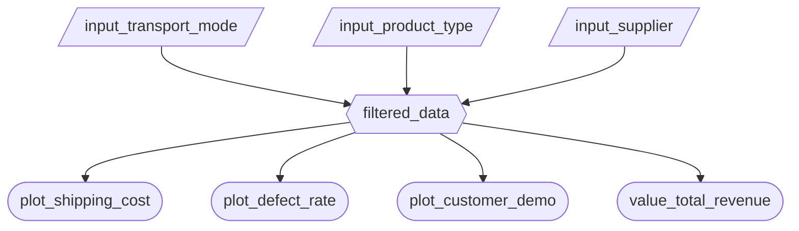
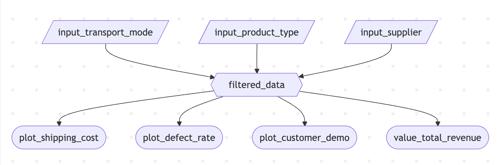

# Milestone 2 - App Specification

## 2.1 Updated Job Stories

| # | Job Story | Status | Notes |
|---|-----------|--------|-------|
| 1 | When reviewing quarterly cost reports, I want to filter shipments by transportation mode and route, so I can identify the most cost-effective shipping methods and investigate root causes of cost overruns. | Pending M2 | Implements User Story 1 and JTBD 1 from M1 proposal |
| 2 | When evaluating supplier performance, I want to compare defect rates across suppliers and locations, so I can assess whether premium suppliers deliver proportional quality value and prioritize quality improvement initiatives. | Pending M2 | Implements User Story 2 and JTBD 2 from M1 proposal |
| 3 | When planning inventory levels, I want to visualize the relationship between lead times and stock levels across product categories, so I can set appropriate safety stock levels and optimize inventory reorder points. | Pending M2 | Implements User Story 3 and JTBD 3 from M1 proposal |
| 4 | When monitoring overall business performance, I want to see high-level KPI metrics for revenue and product sales, so I can quickly assess business health at a glance. | Pending M2 | Supports executive summary view from M1 sketch |

## 2.2 Component Inventory

| ID | Type | Shiny widget / renderer | Depends on | Job story |
|-----|------|-------------------------|------------|-----------|
| `input_transport_mode` | Input | `ui.input_checkbox_group()` | — | #1 |
| `input_product_type` | Input | `ui.input_select()` | — | #1, #3, #4 |
| `input_supplier` | Input | `ui.input_select()` | — | #2 |
| `filtered_data` | Reactive calc | `@reactive.calc` | `input_transport_mode`, `input_product_type`, `input_supplier` | #1, #2, #3, #4 |
| `plot_shipping_cost` | Output | `@render_widget` (Altair) | `filtered_data` | #1 |
| `plot_defect_rate` | Output | `@render_widget` (Altair) | `filtered_data` | #2 |
| `plot_customer_demo` | Output | `@render_widget` (Altair) | `filtered_data` | #4 |
| `value_total_revenue` | Output | `ui.value_box()` | `filtered_data` | #4 |

**Total Components:** 8 (3 inputs, 1 reactive calc, 4 outputs)

**Reactivity Requirements Met:**
- At least one `@reactive.calc` depending on 2+ inputs: `filtered_data` depends on 3 inputs
- At least 2 outputs consuming the same calc: 4 outputs all consume `filtered_data`
- All outputs depend on at least one reactive input: All outputs depend on `filtered_data` which depends on user inputs

## 2.3 Reactivity Diagram

