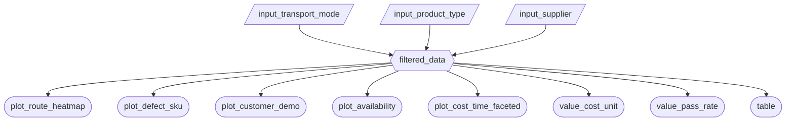

# Milestone 2 - App Specification

## 2.1 Updated Job Stories

| # | Job Story | Status | Notes |
|---|-----------|--------|-------|
| 1 | When reviewing quarterly cost reports, I want to filter shipments by transportation mode and route, so I can identify the most cost-effective shipping methods and investigate root causes of cost overruns. | Implemented | Implements User Story 1 and JTBD 1 from M1 proposal |
| 2 | When evaluating supplier performance, I want to compare defect rates across suppliers and locations, so I can assess whether premium suppliers deliver proportional quality value and prioritize quality improvement initiatives. | Implemented | Implements User Story 2 and JTBD 2 from M1 proposal |
| 3 | When planning inventory levels, I want to visualize the relationship between lead times and stock levels across product categories, so I can set appropriate safety stock levels and optimize inventory reorder points. | Revised | Changed from lead times and stock levels to stock availability |
| 4 | When monitoring overall business performance, I want to see high-level KPI metrics for revenue and product sales, so I can quickly assess business health at a glance. | Revised | Changed from revenue and product sales KPIs to inspection pass rate and manufacturing costs |

## 2.2 Component Inventory

| ID | Type | Shiny widget / renderer | Depends on | Job story |
|-----|------|-------------------------|------------|-----------|
| `input_transport_mode` | Input | `ui.input_checkbox_group()` | — | #1 |
| `input_product_type` | Input | `ui.input_select()` | — | #1, #3, #4 |
| `input_supplier` | Input | `ui.input_select()` | — | #2 |
| `filtered_data` | Reactive calc | `@reactive.calc` | `input_transport_mode`, `input_product_type`, `input_supplier` | #1, #2, #3, #4 |
| `plot_route_heatmap` | Output | `@render_altair` (Altair) | `filtered_data` | #1 |
| `plot_cost_time_faceted` | Output | `@render_altair` (Altair) | `filtered_data` | #1 |
| `plot_defect_sku` | Output | `@render_altair` (Altair) | `filtered_data` | #2 |
| `plot_customer_demo` | Output | `@render_altair` (Altair) | `filtered_data` | #4 |
| `plot_availability` | Output | `@render_altair` (Altair) | `filtered_data` | #3 |
| `value_cost_unit` | Output | `ui.value_box()` | `filtered_data` | #4 |
| `value_pass_rate` | Output | `ui.value_box()` | `filtered_data` | #4 |
| `table` | Output | `@render.data_frame` | `filtered_data` | #1, #2, #3, #4 |

**Total Components:** 12 (3 inputs, 1 reactive calc, 8 outputs)

**Reactivity Requirements Met:**
- At least one `@reactive.calc` depending on 2+ inputs: `filtered_data` depends on 3 inputs
- At least 2 outputs consuming the same calc: 8 outputs all consume `filtered_data`
- All outputs depend on at least one reactive input: All outputs depend on `filtered_data` which depends on user inputs

## 2.3 Reactivity Diagram

## 2.4 Calculation Details

### `filtered_data` (Reactive Calc)

**Depends on:**
- `input_transport_mode`: Checkbox group for transportation modes (Road, Rail, Air, Sea)
- `input_product_type`: Dropdown select for product types (All, haircare, skincare, cosmetics)
- `input_supplier`: Dropdown select for suppliers (All, Supplier 1, Supplier 2, Supplier 3, Supplier 4, Supplier 5)

**Transformation:**
Filters the supply chain dataset based on selected transportation modes, product types, and suppliers. Returns a pandas DataFrame subset that matches all active filter criteria.

**Consumed by:**
- `plot_route_heatmap`: Heatmap showing average shipping costs by route and transportation mode
- `plot_cost_time_faceted`: Faceted bar chart with average cost and time by transport mode
- `plot_defect_sku`: Scatter plot showing defect rates by SKU colored by supplier
- `plot_customer_demo`: Bar chart showing customer demographics distribution
- `plot_availability`: Bar chart showing stock availability by product type
- `value_cost_unit`: Value box displaying average manufacturing cost
- `value_pass_rate`: Value box displaying inspection pass rate
- `table`: DataTable showing filtered data table

**Efficiency Note:**
This single reactive calc ensures data is filtered once per user interaction, not 8 separate times for each output, following best practices from Lecture 3.

